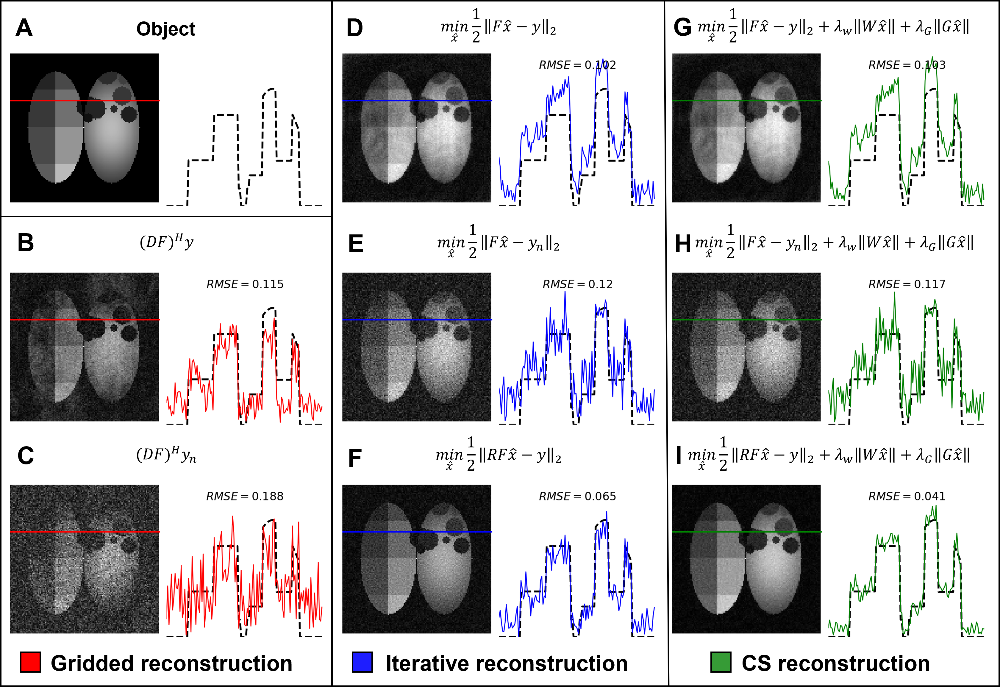

# decay-modeled-cs-paper

A repository that contains non-Cartesian reconstruction software for hyperpolarized xenon MRI. Written by Joseph Plummer (joseph.plummer@cchmc.org, GitHub username: joeyplum). 

Please post all issues, questions, or collaboration requests on the Issues tab. Alternatively, feel free to contact me directly via email or other means. 

## Installation:

Run the following commands in sequence to run the experiments.

1. `conda update -n base -c defaults conda`
2. `make conda`
3. `conda activate decay-modeled-cs-paper`
4. `make pip`

**Troubleshooting**:

1. This repository was tested on an NVIDIA GPU. If running on a system without
   the same, please remove the following packages from `environment.yaml`:
   - `cudnn`
   - `nccl`
   - `cupy`
2. Additionally, if not using an NVIDIA GPU, please set `devnum = -1` for each
   of reconstruction scripts.

## Running the scripts: 

I personally run all scripts using the `Run Current File in Interactive Window' tool in VScode.

## Uninstall:

To uninstall, run the following commands:

1. `conda activate`
2. `make clean`

## DOI:
TBC
